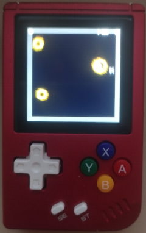
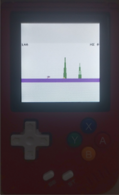
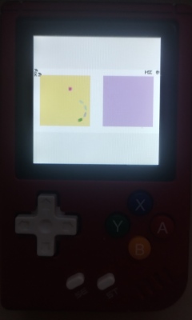
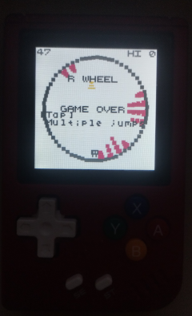
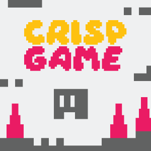

# crisp-game-lib-portable-funkey
   

Seperate repository for funkey-s / RG-Nano as i had to modify games and library to account for a bug that only occurs on those devices.
The trig functions need to have normalized angles (between 0 & 2 x PI) or it will fail over time and draw squares instead of circles and so.
And i could not easily fit in those changes in the original authors repository where i plan to PR the SDL1 & SDL2 port against

original repo is here https://abagames.github.io/crisp-game-lib-portable/ this version is based on my SDL1 port with adaptations for the funkey and rgnano
Below you can find the original Readme

## Screenshots





## Preview for retrofe 


- created by Sai from funkey discord
  
# crisp-game-lib-portable

Minimal C-lang library for creating classic arcade-like mini-games running on devices and browsers. Re-implemented version of [crisp-game-lib](https://github.com/abagames/crisp-game-lib) for smaller devices. You can play [sample games in your browser](https://abagames.github.io/crisp-game-lib-portable/build/).

## Target devices


- [M5StickC PLUS](https://docs.m5stack.com/en/core/m5stickc_plus)
- [M5Stack BASIC](http://docs.m5stack.com/en/core/basic)
- [Playdate](https://play.date/) (Download [crisp-games.pdx.zip](https://abagames.github.io/crisp-game-lib-portable/crisp-games.pdx.zip) and sideload a game.)
- [Adafruit PyBadge](https://learn.adafruit.com/adafruit-pybadge)
- [Arduboy](https://www.arduboy.com/)
- [ESP32-2432S028R](https://ja.aliexpress.com/item/1005004502250619.html)
- [ESPboy](https://www.espboy.com/)

## Sample game codes and reference

- [Sample game codes](https://github.com/abagames/crisp-game-lib-portable/tree/main/src/games)
- Reference
  - [Functions and variables](https://abagames.github.io/crisp-game-lib-portable/ref_document/html/cglp_8c.html)
  - [Structs and macros](https://abagames.github.io/crisp-game-lib-portable/ref_document/html/cglp_8h.html)
  - [2d vector functions](https://abagames.github.io/crisp-game-lib-portable/ref_document/html/vector_8c.html) ([macros](https://abagames.github.io/crisp-game-lib-portable/ref_document/html/vector_8h.html))

## How to write your own game

1. Copy [game_Template.c](https://raw.githubusercontent.com/abagames/crisp-game-lib-portable/main/src/games/game_Template.c) to `game[your game name].c`

1. Comment out other games in [menuGameList.c](https://github.com/abagames/crisp-game-lib-portable/blob/main/src/lib/menuGameList.c) and add `void addGame[your game name]();` and `addGame[your game name]()`

   ```
   ...(snip)...
   void addGameReflector();
   void addGame[your game name]();

   void addGames() {
     /*addGameThunder();
     ...(snip)...
     addGameReflector();*/
     addGame[your game name]();
   }
   ```

1. Write your own game in `game[your game name].c` and rename `void addGame_Template() {` to `void addGame[your game name]() {`

1. [Build for browser](#browser) and debug

1. Once the game is complete, revert other games that were commented out in [menuGameList.c](https://github.com/abagames/crisp-game-lib-portable/blob/main/src/lib/menuGameList.c) and build it for other devices

## Build for [target device]

### M5StickCPlus, M5Stack, PyBadge

1. Install [LovyanGFX library](https://github.com/lovyan03/LovyanGFX)

1. Create `cglp[target device]/` directory (e.g. `cglpM5StickCPlus/`)

1. Copy `cglp[target device].ino`, [./src/lib/\*](https://github.com/abagames/crisp-game-lib-portable/tree/main/src/lib) and [./src/games/\*](https://github.com/abagames/crisp-game-lib-portable/tree/main/src/games) files to the directory

   - [cglpM5StickCPlus.ino](https://github.com/abagames/crisp-game-lib-portable/blob/main/src/cglpM5StickCPlus/cglpM5StickCPlus.ino)
   - [cglpM5Stack.ino](https://gist.github.com/obono/1606cf8a8a4e9c9f97de4ebebad3460a) (ported by [OBONO](https://github.com/obono))
   - [cglpPyBadge.ino](https://github.com/abagames/crisp-game-lib-portable/blob/main/src/cglpPyBadge/cglpPyBadge.ino)

1. Verify and upload `cglp[target device].ino` with [Arduino IDE](https://www.arduino.cc/en/software)

### Playdate

1. Copy [./src/cglpPlaydate](https://github.com/abagames/crisp-game-lib-portable/tree/main/src/cglpPlaydate) directory

1. Create `cglpPlaydate/build` directory

1. Move to `cglpPlaydate/build` directory and `cmake ..`

1. Open `crisp-game-lib-portable.sln` with Visual Studio

1. Build the solution (see [Building for the Simulator using Visual Studio](https://sdk.play.date/2.3.1/Inside%20Playdate%20with%20C.html#_building_for_the_simulator_using_visual_studio))

1. See also [Building for the Playdate using NMake](https://sdk.play.date/2.3.1/Inside%20Playdate%20with%20C.html#_building_for_the_playdate_using_nmake)

### Arduboy

Note: Some features are limited due to device resource limitations.

- [crisp-game-lib-arduboy](https://github.com/obono/crisp-game-lib-arduboy) (ported by [OBONO](https://github.com/obono))

### ESP32-2432S028R

- [cglp-dentaroUI](https://github.com/dentaro/cglp-dentaroUI) (ported by [dentaro](https://github.com/dentaro))

### ESPboy

- [cglpESPboy](https://github.com/ESPboy-edu/ESPboy_crisp-game-lib-portable/tree/main/cglpESPboy) (ported by [ESPboy](https://github.com/ESPboy-edu))

### Browser

1. Install [Emscripten](https://emscripten.org/)

1. Run `dev` npm script to start the dev server and watch [js files](https://github.com/abagames/crisp-game-lib-portable/tree/main/src/browser)

1. Run `dev_c` npm script to watch [c files](https://github.com/abagames/crisp-game-lib-portable/tree/main/src/lib) and build [wasm files](https://github.com/abagames/crisp-game-lib-portable/tree/main/public/wasm)

## How to operate

### Back to the game selection menu

- Hold down the A button and press the B button (M5StickCPlus, M5Stack)
- Press the SELECT button (PyBadge)
- Press A, B, Up and Right buttons simultaneously (Playdate)
- Press the X key while holding down the up and down arrow keys (Browser)

### Toggle sound on/off

- Press the B button (M5StickCPlus)
- Press the C Button (M5Stack)
- Press the START button (PyBadge)
- Press the Z key while holding down the up and down arrow keys (Browser)

### Key assignment on browser

- (A) X key, (B) Z key, (left/right/up/down) arrow keys

## How to port the library to other devices

The source codes for [library](https://github.com/abagames/crisp-game-lib-portable/tree/main/src/lib) and [games](https://github.com/abagames/crisp-game-lib-portable/tree/main/src/games) are written device-independent. Besides, you need to implement device-dependent code for the following functions:

- Device initialization function (e.g. `setup()` in Arduino) that calls `initGame()`

- Frame update function (e.g. `loop()` in Arduino) that calls `setButtonState()` and `updateFrame()`

  - The state of the button press must be notified to the library with the `setButtonState()`

- Drawing and audio processing functions that are defined in [machineDependent.h](https://github.com/abagames/crisp-game-lib-portable/blob/main/src/lib/machineDependent.h)
  - `md_getAudioTime()` function should return the audio timer value in seconds
  - `md_playTone(float freq, float duration, float when)` function should play a tone with `freq` frequency, `duration` length (in seconds) and staring from `when` seconds on the audio timer
  - `md_drawCharacter(unsigned char grid[CHARACTER_HEIGHT][CHARACTER_WIDTH][3], float x, float y, int hash)` function should draw the pixel art defined by `grid[y][x][r, g, b]` at position (x, y). Since `hash` will be the same for the same pixel art, you can cache pixel art images using `hash` as an index and avoid redrawing the same image

Sample device-dependent codes are [cglpM5StickCPlus.ino](https://github.com/abagames/crisp-game-lib-portable/blob/main/src/cglpM5StickCPlus/cglpM5StickCPlus.ino) and [cglpPyBadge.ino](https://github.com/abagames/crisp-game-lib-portable/blob/main/src/cglpPyBadge/cglpPyBadge.ino).

## Porting games from crisp-game-lib using an AI chatbot

You can use an AI chatbot to port game source code for crisp-game-lib to crisp-game-lib-portable. By providing the [prompt](./convert_prompt/prompt.txt) and [set of files](./convert_prompt/knowledge/) to the chatbot, you can obtain the code ported to the C language. I have tried this using [Claude 3 Opus](https://www.anthropic.com/news/claude-3-family), but it is expected to work to some extent with other LLMs as well. The ported code is not perfect, so it needs to be manually checked and corrected.
